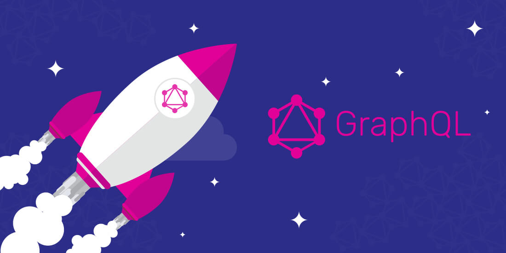
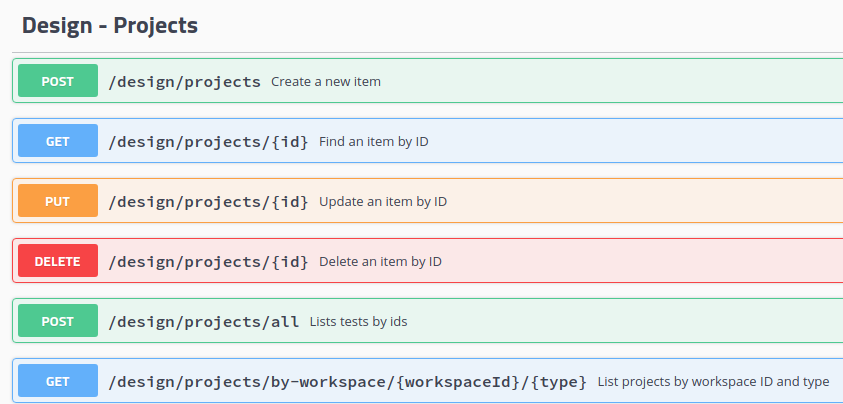

[%notitle]
== GraphQL

[background-color="#e10098"]
== Was ist GraphQL?

* eine Query Language für APIs
* Open Source

== Unterschied von GraphQL und Rest

=== Rest

Server hat fixe Endpoints +
-> Client greift auf diese Endpoints zu

=== Underfetching

Ein Request bringt nicht alle nötigen Daten zurück +
-> mehrere Requests notwendig

=== Overfetching

Ein Request bringt zu viele Daten zurück +
-> Daten werden umsonst verschickt

=== GraphQL

Server hat flexiblere Endpoints +
-> Client gibt genau an, was er braucht

== Verschiedene Implementierungen

GraphQL ist eine Spezifikation +
keine Implementierung +

=== Sprachen

in fast jeder Programmiersprache +
in verschiedenen Implementierungen

