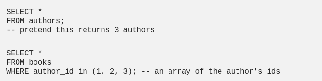
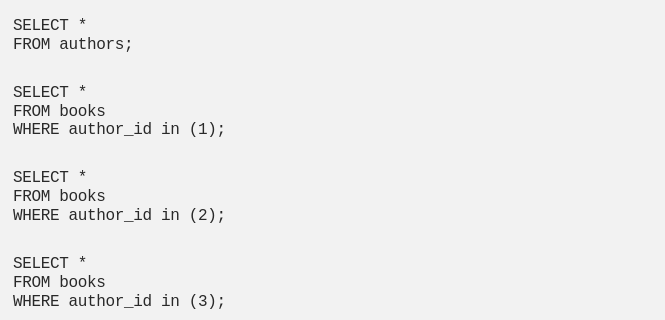

[%notitle]
== GraphQL
image::../images/graphQL.png[background, size=cover]

[background-color="#2c2d89"]
== Was ist GraphQL?

* eine Query Language für APIs
* eine Runtime zur Ausführung dieser Queries
* Open Source seit 2015

[background-color="#2c2d89"]
== Unterschied von GraphQL und Rest

[background-color="#2c2d89"]
=== Rest

Server hat fixe Endpoints +
-> Client greift auf diese Endpoints zu

image:../images/rest-api.png[width=100%]

[background-color="#2c2d89"]
=== Underfetching

Ein Request bringt nicht alle nötigen Daten zurück +
-> mehrere Requests notwendig

[source,json]
----
{
  "book": {
    "title": "A Rose By Any Name",
    "author_id": 1,
    "isbn_13": "7656789876569",
    "year_of_publication": 1923,
    "genre": "Romance"
  }
}
----
[source,json]
----
{
  "author": {
    "id": 1,
    "name": "Katharine Ellis",
    "age": 31
  }
}
----

[background-color="#2c2d89"]
=== Overfetching

Ein Request bringt zu viele Daten zurück +
-> Daten werden umsonst verschickt

[source,json]
----
{
  "book": {
    "title": "A Rose By Any Name",
    "author": {
      "name": "Katharine Ellis",
      "age": 31
    },
    "isbn_13": "7656789876569",
    "year_of_publication": 1923,
    "genre": "Romance"
  }
}
----

[background-color="#2c2d89"]
=== GraphQL

[source,graphql]
----
query allBooks {
   allBooks {
       title
       author {
           name
           age
       }
   }
}
----

[source,json]
----
{
  "book": {
    "title": "A Rose By Any Name",
    "author": {
    "name": "Katharine Ellis",
    "age": 31
    }
  }
}
----

[background-color="#2c2d89"]
=== Alternative Implementierungen

[background-color="#2c2d89"]
== Nachteile

* mehr Arbeit im backend als bei REST
* nur POST Requests -> nicht im Browser möglich

[background-color="#2c2d89"]
=== N + 1 Problem

image:../images/Nplus1_query.png[width=100%]

=== N + 1 Problem

=== N + 1 Problem

